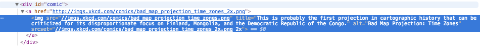
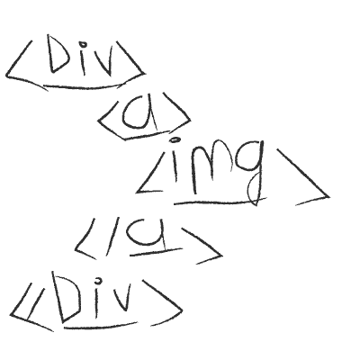
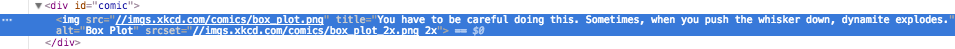

# Use BeatifulSoup for scrap random and last pics from xkcd.com

### Prelude

What we want? Fun and Knowledge. YEAH! Spam and Ham. Nope. Just funny pics and Python hand for take it.


### Prerequisites
  * Python 3
  * PC or Mac
  * Chrome Browser or Firefox
  * Internet

---
### Chapter I
###  _Recon_

Let's Start!

First overview https://xkcd.com


Recon and DOM it's a key.

- Where link on pic?
- Direct or dirty links?
- Different pages - different rules?

1) Open Chrome browser, i think you did it already.

Enable element select mode:
  On Mac press Cmd + Shift + C
  On PC press Ctrl + Shift + C

Click on pics:
WoW! What we see?


Ok, guys, little introduction to DOM.

DOM - like big BOX or Russian Doll


One word for all, remember - NESTED

In html what we take after click, we see - NEST.



Yep, it's simple. What we need? Funy pics, ok that mean "img" tag our choose.

Img tag have, some useful for us attributes.
- src ="//imgs.xkcd.com/comics/bad_map_projection_time_zones.png"  //Links on the picture
- alt ="Bad Map Projection: Time Zones" // Title of pics
Links on image we found.


2) Let's see it's direct or no?

Nope our path of src don't have "http" it's small thing, but later we see it's may be problem.
Not direct.

3) Check another page.

Oooops.




Another page have different structure, but what, tag nest, still same.
Yep - DIV, IMG. It's key for us.

Ok. Go ahead, HARD CODE!!!!

---
### Chapter II
### _Coding_

Before start, let's check some thing.

First - you need simple text editor, yes you can use SOME MAGIC POWER IDE, but it's too easy for us, and we wanna learn some command and principles.

I use VIM, but you can use Sublime Text, it's lightweight editor with powerful potential.

Second - you need Python 3, when i'm wrote this funny-guide i use 3.60 version

Third - you need some libs not included default
- BeautifulSoup (lib name bs4)
- Requests (lib name requests)

Ok. Let's party started.

First we need load libs.
```Python
import os #need for detect working directory
from bs4 import BeautifulSoup
import Requests
```

Second we need some class, yeah we can coding inline, without class, without function, but's it's so boring.

Class it's some thing like box, with some attributes heigh, weight, and cat Shredinger inside, whose can meawing, walking, and die.

Our class must:
- Save default info.
- Connect.
- Find.
- Download.


Let's write some class
```Python
class Soup:

  def __init__(self): # think like born child, and give him some heritage
    self.url = "https://xkcd.com" #path where find
    self.path = os.getcwd() #give path of current work directory     
```

We did it!! Or Not?

Class born but, our ugly kitten, don't know how connect with external world. Teach him.

```Python
  def connect(self):
    response = Requests.get(self.url).text #connect and take all DOM
    self.soup = BeautifulSoup(response, 'lxml') #Feed all Dom to BS and use Fastest parser lxml
```

Born. Meet with Big World. Our kitten must be smart and find some food.

Did you remember, about nest? Let's think again, we wanna find DIV in DOM and find IMG inside. Ok, just do it!
Div have id = 'comic'
Our img inside this div.

Let's take soup and find into some ingredients.

```Python
  def find(self):
    div = self.soup.find(id='comic')  # let's find nest
    self.link = div.find("img")["src"] # take eggs
    self.picname = div.find("img")["alt"] # take title of our pic
```
Ooouch did you remember - link not direct, and we can't download with wrong link. We can do some magic trick.

```Python
  self.link = self.link.replace('//', 'https://') # change that stripes on modern appendix
    or
  self.link = div.find("img")["src"].replace('//', 'https://')
```

Now we need our gold and diamonds, and sure FUNY PICS.

Our kitten, grow and can find food, let's teach him, bring in to home.

You remember in start coding we use os.getcwd() it give us path to current dir, without '/'. And we took name of pic "picname" - variable. For saving we need path, filename, and extension. Combain it.
```Python
  def download(self):
    response = Requests.get(self.link).content # connect and save our pic in memory
    savepath = self.path + '/' + self.picname + '.png'
    f = open(savepath, 'wb') # open file for saving
    f.write(response)
    f.close
```

We teach our kitten bring food, but our kitten haven't brain, and can't do all this things together.

Give him BRAIN.
```Python
  def brain(self):
    self.connect()
    self.find()
    self.download()
```
All part complete let born our smart kitty

```Python
if __name__ == "__main__":
  kitty = Soup()
  kitty.brain()
```

It's all folks. Save, run, and you must see in current dir file with pics.

P.S.
  You program very short and simple.
  You homework it's:
  - make error catch in all parts.
  - make download for random pic
    (hint - key for solve it's number of picture,
      pattern = r"{}/(\d+)".format(self.url) use the force of RegExp Luke)
  - continue fun with scraping

  P.S.S.

  [my little code for it](PicSoup.py)
